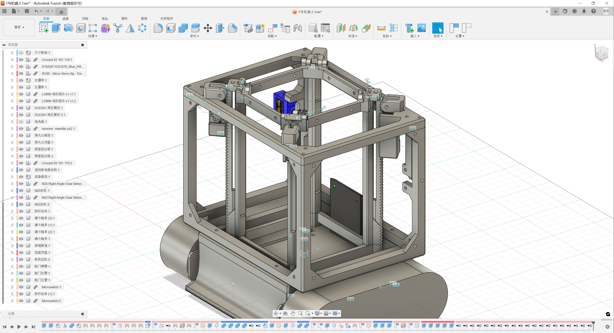
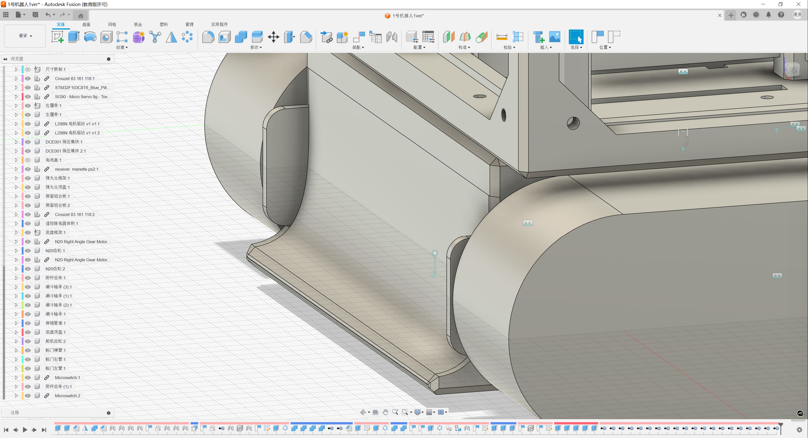
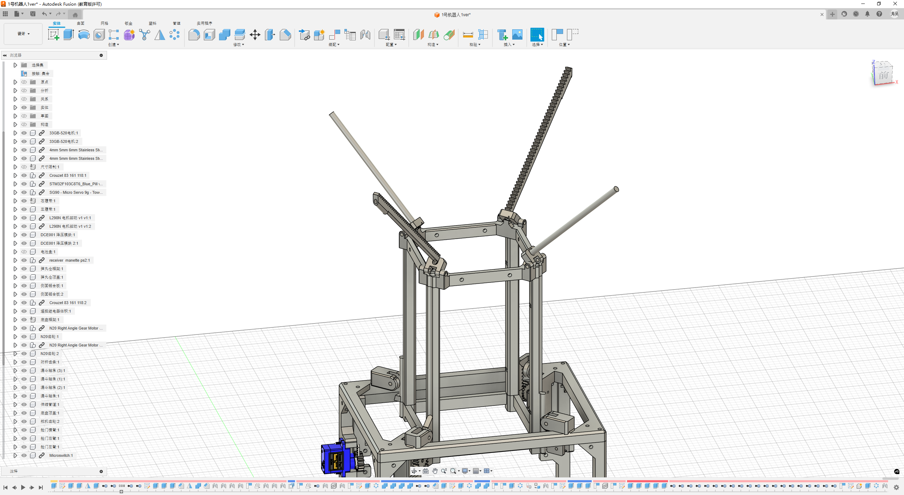
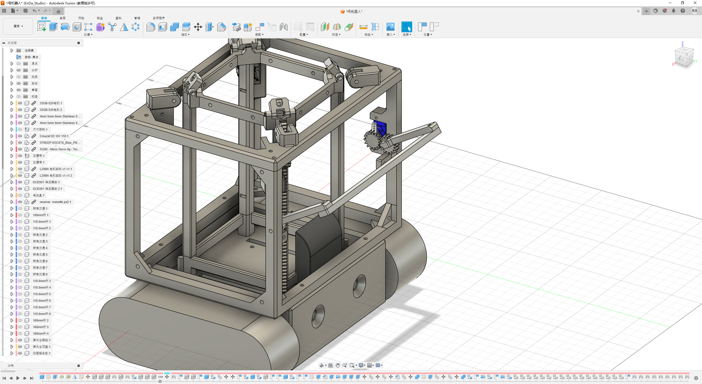
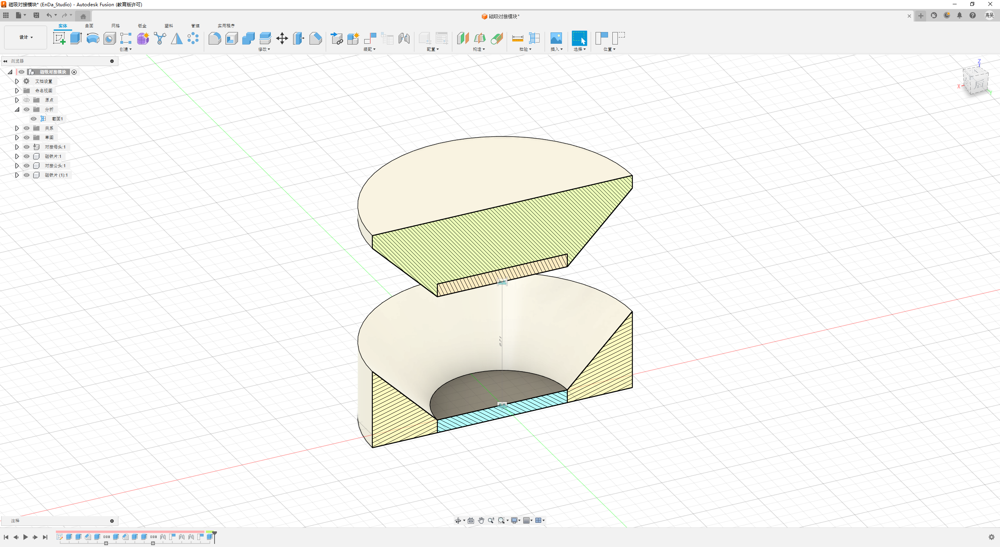

## 一、设计总纲

### 1.1 竞赛情景分析

根据比赛策略，1号机器人需在赛场上扮演多重角色，其主要任务包括：

- **高台抢占**：与对方机器人在中央高台进行对抗，具备较强的挤压与抗挤压能力。
- **弹丸接收**：高效承接从中央高台下落的弹丸。
- **弹丸转运**：安全、稳定地接收来自2号机器人的弹丸。
- **战术干扰**：具备干扰对方机器人行动的能力。

### 1.2 功能需求

基于以上情景分析，1号机器人的核心功能需为：

- **挤压排斥能力**：能够在物理对抗中取得优势。
- **弹丸承接能力**：最大化弹丸的接收效率。
- **弹丸转移能力**：实现与队友机器人的高效对接。
- **弹丸存储能力**：具备大容量的弹丸存储空间。
- **桥梁通行能力**：快速稳定地通过赛场中的桥梁。

#### 开发日志

- **2025.10.5**：基本完成1号机器人的功能需求分析。
- **2025.10.23**：完成1号机器人的零部件打印。
---

## 二、机械结构

### 2.1 履带底盘模块

**设计目标**：实现强大的挤压排斥能力和稳定的机动性。

**技术选型与实现**：

- **驱动方案**：为获得最大抓地力，选用橡胶材质履带，并采用两颗 **33GB-520 电机** 独立驱动，搭配 **L298N 驱动板** 进行控制。该方案动力充沛，足以应对高强度的物理对抗。
- **结构设计**：底盘主体采用 PLA 3D 打印件，在保证结构强度的同时，有效控制了成本与重量。为确保通过桥梁时的稳定性，两履带中心面间距设计为 **20cm**。
- **硬件集成**：底盘内部设计了独立的硬件舱，用于收纳主控板、电池、驱动板等电控元件，便于布线与维护。

#### 开发日志

- **2025.10.7**：完成履带底盘模块的基本设计与选材。
- **2025.10.12**：完成履带底盘模块的建模。
- **2025.10.13**：由于市面上没有质量较好且满足需要的橡胶履带，为确保履带质量与抓地力，现改用塑料履带外套橡皮筋的方案。

### 2.2 主体弹舱模块

**设计目标**：实现大容量的弹丸存储。

**技术选型与实现**：

- **框架材料**：综合考虑成本、重量与强度，选用 **10mm×10mm 的 PLA 打印件** 作为弹仓的整体框架。
- **承接面**：为减轻重量并保证弹丸不会漏出，采用 **孔径为 7mm 的无结尼龙网** 包裹框架。
- **连接方式**：采用束线带及紧固件固定尼龙网与框架，便于安装和更换。
- **尺寸**：为在体积限制内最大化容量，弹仓尺寸设计为 **150mm×150mm×200mm**。

#### 开发日志

- **2025.10.7**：完成主体弹舱模块的基本设计与选材。
- **2025.10.12**：完成主体弹舱模块的建模。

### 2.3 排斥铲斗模块

**设计目标**：在挤压对抗中获得优势。

**技术选型与实现**：

- **外形设计**：铲斗设计为 **弧面楔形**，能够在挤压和被挤压时，通过改变接触角度来获得力学优势。
- **材料**：考虑到定制化需求、强度及轻量化，采用 **PLA 3D 打印件** 作为主要材料。

#### 开发日志

- **2025.10.7**：完成排斥铲斗模块的基本设计与选材。
- **2025.10.13**：完成排斥铲斗模块的建模。

### 2.4 承接漏斗模块

**设计目标**：高效接收从天而降的弹丸，并具备伸缩功能以适应不同赛况。

**技术选型与实现**：

- **伸缩结构**：采用两个 **N20 电机** 结合 **齿轮-齿条结构** 实现漏斗的垂直升降。为确保升降过程的稳定性，采用有自锁功能的螺杆变速箱。
- **限位功能**：搭配两个 **直柄碰撞传感器** 作为行程开关，实现升降过程的限位自停，防止机械结构损坏。
- **漏斗设计**：管道顶部设有一个由四根结构杆撑起的 **网状漏斗**，关节处设有扭转弹簧。在收纳状态下，漏斗与管道平行；伸出后，漏斗自动向外张开，形成一个大口径的接收区域，显著增大弹丸的接收面积。

#### 开发日志

- **2025.10.7**：完成承接漏斗模块的基本设计与选材。
- **2025.10.13**：完成承接漏斗模块的建模。

### 2.5 转移舱门模块

**设计目标**：与2号机器人高效、稳定地对接，接收其收集的弹丸。

**技术选型与实现**：

- **开合控制**：舱门后方设有一个由 **SG90 舵机** 控制的开合机构。
- **尺寸匹配**：舱门的位置和尺寸经过精心设计，与2号机器人的翻斗弹仓模块相适应，确保转移过程无缝衔接。
- **材料**：采用 **PLA 3D 打印件**，以满足定制化需求。

#### 开发日志

- **2025.10.7**：完成转移舱门模块的基本设计与选材。
- **2025.10.14**：完成转移舱门模块的建模。

### 2.6 磁吸对接模块

**设计目标**：提升与2号机器人对接过程的稳定性与抗干扰能力。

**技术选型与实现**：

- **初始方案**：为提升弹丸转移过程的稳定性和抗干扰能力，1号机器人在主体弹仓模块后方中部位置外侧设有钝角L型的活动件。
该结构可绕钝角处的固定轴沿水平方向在一定角内自由旋转，同时在L型的内侧臂上嵌有磁铁，使得其与2号机器人上的磁吸对接模块靠近时相互吸附，从而使L型的活动件向内旋转并形成水平侧向互锁结构，提升了侧向挤压的抵抗能力。
考虑定制化要求，采用PLA 3D打印件作为磁吸对接模块的主要材料。

- **迭代优化**：由于设计空间有限，原方案过于复杂。现简化为 **凹凸圆锥形** 结构，在圆锥顶面设置磁铁圆片。靠近时，两个圆锥结构能够自动对正并吸附，实现快速、稳定的对接。

#### 开发日志

- **2025.10.7**：完成磁吸对接模块的初始设计。
- **2025.10.13**：基于空间限制，对模块进行简化设计，并完成建模。

### 2.7 桥梁纠偏模块

**设计目标**：提升通过桥梁时的稳定性，防止掉落。

**技术选型与实现**：

- **传感器**：在排斥铲斗下方安装两个横向间隔 **14.5cm** 的 **KW8-3 碰撞传感器**，用于检测车体是否偏离桥梁。
- **双重功能**：
    - **辅助轮**：传感器碰撞末端设有小型导轮。当车体在桥上时，传感器被压回，导轮起到辅助支撑作用。
    - **侧向限位**：当车体一侧偏离桥梁时，该侧传感器会因失去支撑而伸出，触发纠偏逻辑，同时在物理上起到一定的限位作用。

#### 开发日志

- **2025.10.7**：完成桥梁纠偏模块的基本设计与选材。

---

## 三、硬件架构

### 3.1 电源系统设计

#### 电流消耗分析

为了评估机器人在不同工况下的续航能力，我们对各硬件模块的电流消耗进行了估算。下表汇总了主要耗电组件在不同状态下的电流值：

| 硬件模块                | 数量  | 状态         | 单个电流 (A) | 总电流 (A) |
| :------------------ | :-- | :--------- | :------- | :------ |
| **主控 (STM32F103)**  | 1   | 运行 (72MHz) | 0.0055   | 0.0055  |
|                     |     | 待机         | 0.00003  | 0.00003 |
| **底盘电机 (33GB-520)** | 2   | 空载         | 0.1      | 0.2     |
|                     |     | 平均负载       | 0.5      | 1.0     |
|                     |     | 堵转 (估算)    | 3.0      | 6.0     |
| **漏斗电机 (N20)**      | 2   | 平均负载       | 0.12     | 0.24    |
|                     |     | 堵转         | 0.2      | 0.4     |
| **舱门舵机 (SG90)**     | 1   | 工作         | 0.2      | 0.2     |
|                     |     | 堵转         | 0.5      | 0.5     |
| **PS2 接收器**         | 1   | 工作         | 0.015    | 0.015   |
| **碰撞传感器**           | 4   | 触发         | < 0.001  | < 0.004 |

**不同场景下的总电流估算：**

1.  **待机状态 (仅主控运行)**
    *   总电流 ≈ 0.0055 A

2.  **常规移动 (底盘平均负载)**
    *   总电流 ≈ 主控 (0.0055A) + 底盘电机 (1.0A) + PS2 (0.015A) ≈ **1.02 A**

3.  **复杂任务 (移动 + 漏斗 + 舱门)**
    *   总电流 ≈ 主控 (0.0055A) + 底盘 (1.0A) + 漏斗 (0.24A) + 舱门 (0.2A) + PS2 (0.015A) ≈ **1.46 A**

4.  **极限峰值电流 (底盘堵转 + 其他满载)**
    *   总电流 ≈ 主控 (0.0055A) + 底盘堵转 (6.0A) + 漏斗堵转 (0.4A) + 舱门堵转 (0.5A) + PS2 (0.015A) ≈ **6.92 A**

基于以上分析，市面上大部分容量型电池都难以满足持续放电电流的要求。因此，决定采用动力性电池。我们在淘宝上搜寻了一些动力性电池的信息：

| 电池型号 | 典型容量 (mAh) | 持续放电电流 (A) | 5分钟峰值功率 (W) | 10-15A负载下电压稳定性 | 循环寿命耐久性 | 预计单位成本 (RMB) |
| :---- | :---- | :---- | :---- | :---- | :---- | :---- |
| Molicel P28A | 2800 | 35 2 | 87.4 13 | 极高 | 优秀 | 约 35-45 |
| Murata VTC6 | 3000 | 15 (温控下更高) 8 | N/A | 非常高 10 | 良好，但有衰减较快的报告 10 | 约 30-40 |
| **Samsung 30Q** | **3000** | 15 7 | 75.7 15 | 高，略低于VTC6 16 | 非常优秀，优于VTC6 10 | **约 20-28** |
| **Samsung 25R** | **2500** | 20 9 | 63.4 18 | **良好** | **良好** | **约 15-22** |

综合考虑电流，容量和成本方面的需求，我们选择了 三星 25R 18650 动力锂电池作为电芯，采用4S1P 的组合方式（14.8V 标称电压）。该电芯在保证充足动力的同时，将重量和体积控制在合理范围内。

---
### 3.2 硬件总体架构

为实现上述功能，硬件电路拓扑图如下所示：

经实践，由于L298N自带的5V降压模块极不稳定且会增加L298N的发热量，决定使用DCE001降压模块提供5v电源。
#### 开发日志

- **2025.10.4**：完成1号机器人硬件电路拓扑图的初步绘制。

## 四、电控设计

### 4.1 系统架构与技术选型

**硬件平台**：STM32F103C8T6 (ST-Link V2)
**开发工具**：STM32CubeMX + VSCode + EIDE + OpenOCD + Cortex-Debug

#### 4.1.1 操作系统：FreeRTOS vs 裸机

- **裸机轮询**：实现简单，但难以保证多任务实时性，尤其是在需要同时处理高频输入、电机控制和紧急避障的复杂场景下。
- **FreeRTOS**：支持任务优先级和队列通信，能够优雅地协调各个任务，确保关键任务（如碰撞检测）的优先执行。

**选择理由**：考虑到机器人需要同时处理 **50Hz 的手柄输入**、**100Hz 的电机控制** 和 **高优先级的碰撞检测**，FreeRTOS 的多任务调度机制是保证系统实时性和稳定性的不二之选。

#### 4.1.2 PS2 通信方式：软件 GPIO vs 硬件 SPI

| 方案 | 优点 | 缺点 | 适用性分析 |
| :--- | :--- | :--- | :--- |
| **GPIO** | 配置灵活，已有现成驱动 | CPU 开销较大 | 适合快速原型开发，但在多任务环境下会抢占宝贵的 CPU 资源。 |
| **SPI** | 硬件处理，性能消耗小 | 现有教程不适配双灯版 PS2 | 适合 CPU 资源紧张、需要高频轮询的场景。 |

**选择理由**：由于 FreeRTOS 下运行多个任务，且 PS2 轮询频率较高，为节省 CPU 资源，选择 **硬件 SPI** 方案。

### 4.2 核心功能实现

#### 4.2.1 PS2 远程控制

**设计目标**：稳定读取手柄数据，并将摇杆与按键信息实时解析，通过队列发送给相应任务。

**技术难点与解决方案**：

- **问题：SPI 模式错误**
    - **现象**：初始配置（CPHA=1Edge）导致连接器绿灯慢闪，通信不稳定。
    - **解决方案**：查阅资料后确认，双灯版 PS2 需将 SPI 模式配置为 **CPHA = 2 Edge**。修改后通信恢复正常。
- **问题：摇杆数据解析**
    - **现象**：摇杆原始数据范围为 0–255，不便于直接用于差速控制。
    - **解决方案**：将数据映射到 **-128 ~ +127** 的范围，0点居中，便于进行速度和方向的计算。

**FreeRTOS 任务设计**：

- **任务名**：`ps2Task`
- **优先级**：`AboveNormal`，确保输入响应的及时性。
- **数据流**：
    - 摇杆数据 → `motorQueue01` (底盘电机)
    - L1/L2 肩键 → `servoQueue` (转移舱门)
    - R1/R2 肩键 → `motorQueue02` (承接漏斗)
    - 〇 键 → `lockModeQueue` (防挤压驻守)

#### 4.2.2 双电机驱动与差速转向

**设计目标**：实现左右履带的独立控制，支持差速转向，并具备“主动刹车”功能以避免惯性滑行。

**技术实现**：

- **PWM 控制**：使用 TIM 输出 **1kHz** 的 PWM 信号驱动 L298N，该频率可有效避免电机啸叫。
- **主动刹车逻辑**：当摇杆回中，速度指令为0时，将对应的 IN1 和 IN2 引脚同时置为高电平，形成 **短路制动**。这使得电机立即停止，而不是随惯性滑行，极大地提升了操控精度。
- **摇杆死区**：设置 **±10** 的摇杆死区，避免因手柄摇杆的物理抖动导致电机产生不必要的微动。

#### 4.2.3 转移舱门舵机控制

**设计目标**：通过 L1/L2 按键控制后舱门的开合，支持连续转动。

**技术实现**：

- **PWM 输出**：使用 TIM1 CH1 输出 **50Hz** 的 PWM 信号控制 SG90 舵机。
- **角度映射**：将 0° 映射为 0.5ms 脉宽，180° 映射为 2.5ms 脉宽。
- **连续转动与冲突保护**：
    - **优化前**：按键单次触发，控制不连续。
    - **优化后**：改为 **长按时持续转动**，每 10ms 调整 2°。同时，当 L1 和 L2 被同时按下时，判定为逻辑冲突，舵机停止动作。

#### 4.2.4 实体碰撞检测与桥梁纠偏

**设计目标**：在通过桥梁时，一旦检测到一侧悬空，立即自动纠偏，防止掉落。该功能需具备高优先级和高可靠性。

**技术难点与解决方案**：

- **问题：中断抖动严重**
    - **现象**：初始采用 GPIO EXTI 中断方案，但由于机械结构带来的物理抖动，导致中断被频繁触发，逻辑混乱。
    - **解决方案**：改为 **10ms 软件轮询**，并结合 **50ms 的防抖计时**。即连续 5 次（50ms）检测到相同状态后，才确认状态有效，有效过滤了抖动干扰。
- **问题：逻辑反转**
    - **现象**：微动开关为 **NO (Normally Open)** 型，导致检测逻辑与预期完全相反。
    - **解决方案**：在确认硬件特性后，修正了软件中的判断条件。
- **问题：纠偏动作卡顿**
    - **现象**：检测到悬空后，直接将一侧电机速度降为0，导致车体产生剧烈冲击，动作不平滑。
    - **解决方案**：引入 **“目标速度 + 平滑过渡”** 算法。当需要纠偏时，将目标速度设定为原速度的 **40%**，然后每 10ms 将当前速度向目标速度调整 **12%**。这使得减速过程变得平滑，车体姿态更稳定。

**参数调优**：

- **减速比例**：经过 60% → 30% → **40%** 的实测对比，40% 的减速比例既能实现快速纠偏，又不会产生过大的转向惯性。
- **平滑步长**：经过 5% → 20% → **12%** 的测试，12% 的步长在响应速度和平滑度之间取得了最佳平衡。

#### 4.2.5 防挤压驻守模式（圆圈键锁止）

**背景**：在高台等关键位置驻守时，需要一种模式能抵抗外力推动，保持原地不动。

**需求演变与技术迭代**：

1.  **v1.0 - 5Hz 瞬间正反转**
    - **实现**：每 200ms 在满速正转和满速反转之间切换。
    - **问题**：切换频率过快，机械冲击剧烈，噪音极大，且对电机和传动结构损害严重。

2.  **v1.1 - 2Hz 平滑过渡**
    - **实现**：周期延长至 500ms，并引入平滑加速/减速。
    - **问题**：虽然冲击减小，但缺少“锁止”的感觉，更像是在原地“抽搐”。

3.  **v2.0 - 三阶段平滑控制（最终方案）**
    - **设计思想**：将一个完整的锁止周期（2秒）分为 **加速 → 减速 → 零速停留** 三个阶段，模拟一种“对抗-释放-再对抗”的节奏，既有锁止力，又平滑。
    - **技术实现**：
        - **状态机**：使用 `lockPhase` 变量追踪当前所处阶段（0=加速, 1=减速, 2=停留）。
        - **线性插值**：在加速和减速阶段，每 10ms 更新一次速度值，确保速度变化平滑。
        - **低速运行**：为降低能耗和噪音，将最大速度限制在 **±64**（约50%功率）。
        - **零速停留**：在每个周期的末尾增加一个 **500ms** 的零速阶段，让机械结构有时间完全释放应力，提升了锁止的稳定性。
    - **优先级**：该功能由〇键触发，在逻辑上拥有最高优先级，会覆盖摇杆的输入。

**关键参数选择理由**：

- **速度 64 (非 127)**：在提供足够锁止力的同时，避免了高速切换带来的剧烈抖动和巨大噪音。
- **阶段时长 500ms**：在 10ms 的任务周期下，每个阶段包含 50 次插值计算，足以保证速度曲线的平滑。

