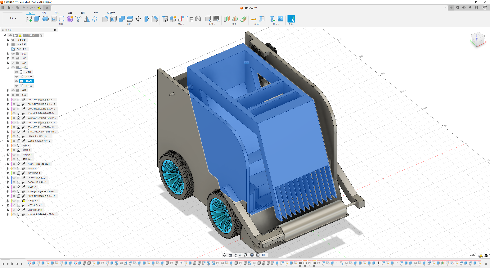
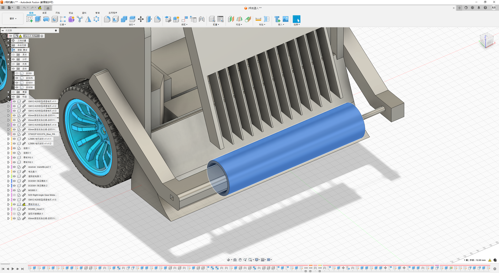
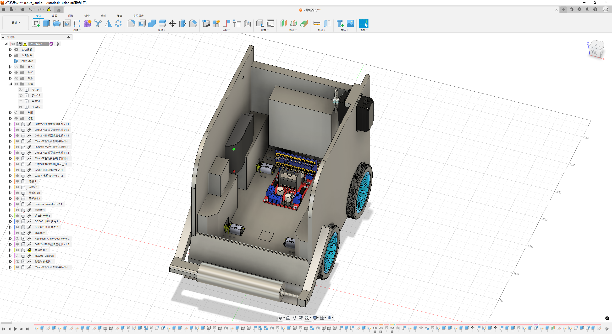

## 一、设计总体纲领

---

**根据比赛策略设计，2号机器人可能面临的情景有：**

- 干扰对方机器人时产生挤压；
- 在地面迅速收集大量弹丸；
- 向1号机器人转移弹丸。

**由此可知，2号机器人所需要的功能如下：**

- 弹丸收集能力
- 灵活机动能力
- 弹丸转移能力
- 弹丸存储能力

**为实现以上功能，对2号机器人的模块设计如下：**

- 翻斗弹仓模块
- 收集滚筒模块
- 磁吸对接模块
- 四驱底盘模块

## 二、机械结构设计

---

### 翻斗弹仓模块

为实现弹丸存储能力和弹丸转移能力，在2号机器人后方主体位置设置一个翻斗状的弹仓。
该弹仓上平面前半侧有间隔25mm，宽5mm的条幅阻挡栅，用于防止外部拿取弹丸；前侧面开口，用于接收前方收集滚筒模块收集到的弹丸；
后侧面上部与一个 MG995 舵机相连，使弹仓能向后翻转倾倒弹丸，从而实现弹丸向1号机器人的转移；
综合考虑成本、重量限制、强度要求和制作难度，该弹仓的主体结构与1号机器人的主体弹仓模块基本一致。

#### 模块开发日志

##### 2025.10.8

- 完成翻斗弹仓模块的基本设计与选材。
##### 2025.10.24

- 基本完成翻斗弹仓模块建模。

---

### 收集滚筒模块

为实现地面弹丸的快速收集能力，2号机器人前方设置一个宽距疏排毛刷滚筒，由减速比为1：100的12v N20电机驱动。
该滚筒后方下侧有一个弧形挡板，用于将滚筒扫入的弹丸导向翻斗弹仓模块的开口；
滚筒后方上侧有一个梳齿状的挡板，在允许滚筒上的毛刷交错通过的同时将扫到的弹丸阻挡下来；
为能收集到墙角处的弹丸，毛刷的长度应大于等于与滚筒截面圆外切的正方形的对角线长度的一半；
考虑定制化要求，采用PLA 3D打印件作为滚筒主体的主要材料。

#### 模块开发日志

##### 2025.10.8

- 完成收集滚筒模块的基本设计与选材。
##### 2025.10.24

- 基本完成收集滚筒模块的建模。

---

### 磁吸对接模块

为提升弹丸转移过程的稳定性和抗干扰能力，2号机器人在主体弹仓模块后方中部位置外侧设有钝角L型的活动件。
该结构可绕钝角处的固定轴沿水平方向在一定角内自由旋转，同时在L型的内侧臂上嵌有磁铁，使得其与1号机器人上的磁吸对接模块靠近时相互吸附，从而使L型的活动件向内旋转并形成水平侧向互锁结构，提升了侧向挤压的抵抗能力。
考虑定制化要求，采用PLA 3D打印件作为磁吸对接模块的主要材料。

由于设计空间有限，原方案过于复杂。现简化为 **凹凸圆锥形** 结构，在圆锥顶面设置磁铁圆片。靠近时，两个圆锥结构能够自动对正并吸附，实现快速、稳定的对接。
#### 模块开发日志

##### 2025.10.8

- 完成磁吸对接模块的基本设计与选材。
##### 2025.10.13

- 基于空间限制，对模块进行简化设计，并完成建模。

---

### 四驱底盘模块

为实现灵活机动能力，综合考虑抓地力，机动性和泡沫垫可塑性等因素，决定使用4个12v驱动的300RPM N20电机，搭配65mm直径的橡胶轮胎作为2号机器人的底盘。
为适配体积尺寸要求，采用PLA 3D打印件作为底盘的结构框架。

底盘主体为硬件舱，用于为机器人的硬件布线与收纳提供空间，内部设置供电系统和控制系统。
#### 模块开发日志

##### 2025.10.8

- 完成了2号机器人 硬件电路拓扑图的绘制。
- 完成四驱底盘模块的基本设计与选材。

---

## 三、硬件架构设计

### 3.1 电源系统设计

#### 电流消耗分析

为了评估机器人在不同工况下的续航能力，我们对各硬件模块的电流消耗进行了估算。下表汇总了主要耗电组件在不同状态下的电流值：

| 硬件模块                | 数量  | 状态         | 单个电流 (A) | 总电流 (A) |
| :------------------ | :-- | :--------- | :------- | :------ |
| **主控 (STM32F103)**  | 1   | 运行 (72MHz) | 0.0055   | 0.0055  |
|                     |     | 待机         | 0.00003  | 0.00003 |
| **底盘电机 (N20)**     | 4   | 空载         | 0.08     | 0.32    |
|                     |     | 平均负载       | 0.25     | 1.0     |
|                     |     | 堵转 (估算)    | 0.8      | 3.2     |
| **滚筒电机 (N20)**     | 1   | 平均负载       | 0.25     | 0.25    |
|                     |     | 堵转         | 0.8      | 0.8     |
| **翻斗舵机 (MG995)**   | 1   | 工作         | 0.5      | 0.5     |
|                     |     | 堵转         | 1.2      | 1.2     |
| **PS2 接收器**         | 1   | 工作         | 0.015    | 0.015   |

**不同场景下的总电流估算：**

1.  **待机状态 (仅主控运行)**
    *   总电流 ≈ 0.0055 A

2.  **常规移动 (底盘平均负载)**
    *   总电流 ≈ 主控 (0.0055A) + 底盘电机 (1.0A) + PS2 (0.015A) ≈ **1.02 A**

3.  **收集弹丸 (移动 + 滚筒)**
    *   总电流 ≈ 主控 (0.0055A) + 底盘 (1.0A) + 滚筒 (0.25A) + PS2 (0.015A) ≈ **1.27 A**

4.  **弹丸转移 (移动 + 翻斗)**
    *   总电流 ≈ 主控 (0.0055A) + 底盘 (1.0A) + 翻斗舵机 (0.5A) + PS2 (0.015A) ≈ **1.52 A**

5.  **极限峰值电流 (底盘堵转 + 其他满载)**
    *   总电流 ≈ 主控 (0.0055A) + 底盘堵转 (3.2A) + 滚筒堵转 (0.8A) + 翻斗堵转 (1.2A) + PS2 (0.015A) ≈ **5.22 A**

基于以上分析，我们选择了三星 25R 18650 动力锂电池作为电芯，采用3S1P 的组合方式（11.1V 标称电压）。在保证充足动力的同时，将重量和体积控制在合理范围内。

### 3.2 硬件总体架构

为实现上述功能，硬件电路拓扑图如下所示：

经实践，由于L298N自带的5V降压模块极不稳定且会增加L298N的发热量，决定使用DCE001降压模块提供5v电源。

#### 开发日志

- **2025.10.8**：完成2号机器人硬件电路拓扑图的初步绘制。

## 四、电控系统设计

### 4.1 系统架构与技术选型

**硬件平台**：STM32F103C8T6 (ST-Link V2)
**开发工具**：STM32CubeMX + VSCode + EIDE + OpenOCD + Cortex-Debug

#### 4.1.1 操作系统：FreeRTOS vs 裸机

与一号机器人相同，考虑到需要同时处理多个任务，我们选择了FreeRTOS作为操作系统。这使得我们能够更好地管理不同优先级的任务，如手柄输入、电机控制和传感器检测等。

#### 4.1.2 PS2 通信方式

同样采用硬件SPI方案，以减少CPU资源占用，确保系统的实时性和稳定性。

### 4.2 核心功能实现

#### 4.2.1 PS2 远程控制

**设计目标**：稳定读取手柄数据，并将摇杆与按键信息实时解析，通过队列发送给相应任务。

**技术实现**：
- 左摇杆控制底盘前后移动
- 右摇杆控制底盘左右转向
- △ 键控制滚筒电机启停
- □ 键控制翻斗舵机翻转

**FreeRTOS 任务设计**：
- **任务名**：`ps2Task`
- **优先级**：`AboveNormal`
- **数据流**：
  - 摇杆数据 → `motorQueue01` (底盘电机)
  - △ 键 → `motorQueue02` (滚筒电机)
  - □ 键 → `servoQueue` (翻斗舵机)

#### 4.2.2 四轮差速驱动控制

**设计目标**：实现四轮独立控制，支持差速转向，提供灵活的机动性。

**技术实现**：
- **PWM 控制**：使用 TIM 输出 **1kHz** 的 PWM 信号驱动 L298N
- **差速算法**：
  - 前进/后退：四个轮子速度相同
  - 左转：右侧轮子速度大于左侧轮子
  - 右转：左侧轮子速度大于右侧轮子
- **摇杆死区**：设置 **±10** 的摇杆死区，避免因手柄摇杆的物理抖动导致电机产生不必要的微动

#### 4.2.3 滚筒电机控制

**设计目标**：通过 △ 键控制滚筒电机的启停，实现弹丸的高效收集。

**技术实现**：
- **PWM 输出**：使用 TIM 输出 PWM 信号控制 N20 电机
- **启停逻辑**：△ 键按下时切换滚筒电机的启停状态
- **速度控制**：滚筒电机以固定速度运行，确保弹丸收集效率

#### 4.2.4 翻斗舵机控制

**设计目标**：通过 □ 键控制翻斗舵机的翻转，实现弹丸的转移。

**技术实现**：
- **PWM 输出**：使用 TIM 输出 **50Hz** 的 PWM 信号控制 MG995 舵机
- **角度控制**：
  - 默认位置：0°（弹仓水平）
  - 翻转位置：90°（弹仓倾斜，弹丸倾倒）
- **翻转逻辑**：□ 键按下时，舵机从当前位置翻转到另一个位置
- **自动复位**：翻转后延时 **2秒** 自动复位，确保弹丸完全倾倒

### 4.3 系统集成与优化

#### 4.3.1 电源管理

为确保系统稳定运行，我们对电源系统进行了以下优化：
- 使用独立的 DCE001 降压模块为控制系统提供稳定的 5V 电源
- 为舵机提供单独的电源线路，避免大电流负载对控制系统的干扰
- 添加滤波电容，减少电源纹波

#### 4.3.2 任务调度优化

基于 FreeRTOS 的任务调度机制，我们对各任务的优先级和执行周期进行了优化：
- PS2 输入任务：20ms 周期，优先级 AboveNormal
- 电机控制任务：10ms 周期，优先级 Normal
- 舵机控制任务：20ms 周期，优先级 BelowNormal

#### 开发日志

- **2025.10.10**：完成 PS2 控制器驱动的移植和测试
- **2025.10.15**：完成四轮差速驱动算法的实现
- **2025.10.18**：完成滚筒电机和翻斗舵机的控制逻辑
- **2025.10.20**：进行系统集成测试，优化任务调度
